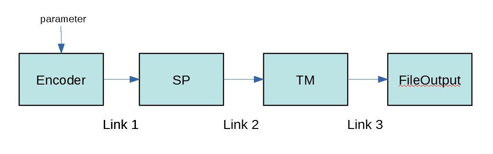

# Network API Links

Network API is all about experimenting and building apps from the HTM building blocks (or regions) which are wrappers around the htm algorithms. See [Network API Regions](NetworkAPI_Regions.md).   But to be useful, we also need to be able to connect up those building blocks so that data can flow between them. We do that with links.

## Data Flow
A link is a data path with buffers on both ends.  The buffer on the source end of the link are assiciated with an output of a region. The buffer on the destination end of the link is associated with an input to a region.  

When a region is executed, it will call the underlining algorithm using data from the input buffer to generated some output.  That output is moved to the output buffer. After each region is executed its outputs are propogated through all links assigned to that output. 

Here is an example of a NetworkAPI configuration using JSON syntax:
```
   {network: [
       {addRegion: {name: "encoder", type: "RDSEEncoderRegion", params: {size: 1000, sparsity: 0.2, radius: 0.03, seed: 2019, noise: 0.01}}},
       {addRegion: {name: "sp", type: "SPRegion", params: {dim: [2,1024], globalInhibition: true}}},
       {addRegion: {name: "tm", type: "TMRegion", params: {cellsPerColumn: 8, orColumnOutputs: true}}},
       {addRegion: {name: "fileOutput", type "FileOutputRegion", params: {outputFile: "result.csv"}
       {addLink:   {src: "encoder.encoded", dest: "sp.bottomUpIn"}},
       {addLink:   {src: "sp.bottomUpOut", dest: "tm.bottomUpIn"}}
       {addLink:   {src: "tm.bottomUpOut", dest: "fileOutput.DataIn"}}
    ]})";
```
The app, in a loop, would set a value in the parameter "sensedValue" on the encoder then call `run(1)`.

As you can see in this diagram, on a single iteration of a run, data will flow through the blocks from one to another.

The regions are executed in the order that they are declared in the configuration (modified by the phase into which they may be placed).  Here is basicly what happens:
- The encoder has no links connected to its inputs.  The encoder is executed and using the current value of the parameter SensedValue, produces data in the "encoded" output of the encoder. That data is then distributed along the output link to connected input buffer named "bottomUpIn" of the sp region.
- The SP is executed with that input and produces an output in sp.bottomUpOut. The sp region has a link connected to its output so the buffer in sp.bottomUpOut is moved to tm.bottomUpIn.
- TM is executed and produces data on several outputs but only one has a link. The FileOutput region is connected from TM with a link so the buffer in tm.bottomUpOut is moved to fileOutput.DataOut. 
- Then the FileOutput region is executed and saves the data in its input buffer fileOutput.DataIn, into the file.

So the data cascades through the links.

## How to configure
After you have declared all of your regions with addRegion entries as shown above, the links can be declared. Actually, the links can be declared in any order as long as the referenced regions have been previously defined.

You can use the a Yaml or JSON encoded configuration as shown in the above example and pass this to the configure(config) method on the Network object.  For a C++ or Python app you can also call addRegion( ... ) and link( ... ) functions on the Network object.

The syntax for a Link declaration using JSON format:
```
addLink: {src: "<srcName>.<srcOutput>",
          dest: "<destName>.<destInput>",
          dim: [<dimensions>], 
          mode: [<"overwrite" or "<fanin>"]
          delay: <propogationDelay>}
         }
```

The syntax for a Link declaration using C++ calls:
```
link(<srcName>, <destName>, "", "{dim: [<dimensions>], mode: <"overwrite" or "fanin">}", <srcOutput>, <destInput>, <propogationDelay>);
```

The syntax for a Link declaration using Python calls:
```
link(srcName, destName, LinkType, LinkParams, srcOutput, destInput, propogationDelay)
```
- The `srcName` and `destName` are the names given to the two region instances that are the endpoints of the links.

- The optional `dim` parameter is only required for the special case of the "INPUT" source discussed later. 

- The optional `mode` parameter is only needed if there are more than one link connected to the destination buffer. A value of "overwrite" means the outputs from each link will overwrite the entire input buffer.  The last output to execute wins.  A value of "fanin" means put the outputs from each link into separate portions of the input buffer.  See more about the Fan-In condition below. If not given, the mode is "fanin".

- The `srcOutput` and `destInput` are the targets of the link on their respecitive regions.  For backward compatability, if either is not given or blank (not recomended), they are the ones identified as the default for the region in the Spec. 

- The optional `delay` argument is propogation delay parameter to set the number of iterations to delay the buffer movements. 

Note that it is ok to setup links such that they form a circlar flow of data.  If the input for a region comes from a region that has not yet been executed, the value in the input will be 0's the first time and subsequently it will be the value that was in the source buffer from the previous iteration.


## Data type conversion
The link determines data type of the source buffer from the Spec of the Output which it obtains from the source region.  It then determines the destination buffer's type from the Spec of the input from the destination's region.

The link expects data to be an array.  Internally these are held within a shared_ptr in the Array object. With the exception of Bool, SDR, and Str, it assumes the data resides in a fixed contiguous C-type buffer.  Scalar values can be treated as an array of size 1. 

The types can be:  (as defined in htm/types/Types.hpp)
- Byte - an 8 bit signed integer
- Int16 - a 16 bit signed integer
- UInt16 - a 16 bit unsigned integer
- Int32  - a 32 bit signed integer
- UInt32 - a 32 bit unsigned integer
- Int64  - a 64 bit signed integer
- UInt64 - a 64 bit unsigned integer
- Real32 - a 32 bit floating point (a float)
- Real64 - a 64 bit floating point (a double)
- Bool   - a boolean value, true & false
- SDR    - a Sparse Distributed Representation object
- Str    - a String, UTF-8

If the types on both source and destination are the same (and there is no delay or Fan-In), then the link will try to move the source ouptput data in a shared_ptr to the destination's input buffer and no copying is performed.  If they are not the same then the link performs an automatic type conversion on each element of the array.

For example, if the source buffer consist of a C-type array of Real32 values and the target is an SDR then it knows that for an SDR the values must be converted to a dense byte array of 1's or 0's so any value other than 0.0 will be treated as a 1.

## Fan-In
There may be times when more than one region output should be connected to a single input of a region. To implement, configure a link for each output and indicate the same target input.

If the `overwrite` mode was not specified, the data from each source is converted to the type of the destination and then their buffers are concatinated.  So, the input buffer size will be the sum of the widths of all of the source buffers.

This is convenent for the construction of an app that employs multiple encoders to encode independent variables.  It is the concatination of the encoder outputs that should be presented to the SP to turn this into a true SDR.

## Fan-Out
There may be times that a single source output will be connected to multiple destination inputs.  To implement, use one link per input and reference the same source output. The data is moved to a destination input when that source region is executed.

## Propogation Delay
The link also has the feature of being able to delay the propogation of an output buffer by a number of run iterations.  This is configured by setting the link property `propogationDelay` to the number of run iterations to delay.  Normally this is 0 and there is no delay.  The propogationDelay queue is rotated after an output is generated. The value in the output buffer is placed into the bottom of the queue and the value being propogated to the input is the buffer at the top of the queue.

For example. If the propogationDelay is set to 2 then the propogation will be something like this:
```
T0   buffer out = 1 -->   queue   --> buffer in = 0
T1   buffer out = 2 -->   queue   --> buffer in = 0
T2   buffer out = 3 -->   queue   --> buffer in = 1
T3   buffer out = 4 -->   queue   --> buffer in = 2
...
```
This is useful for solving timing issues.

## Dimensions and Buffer size  

For the Link to do its job, it must control the buffers that reside on region outputs and inputs to minimize the copying of data.  So at initialization it determines the buffer types and sizes from the information in the  dimensions configured. The types and dimensions on all inputs and outputs must resolve at initialization time so that the buffers can be pre-allocated.  After initialization time all dimensions are fixed and buffer sizes cannot be changed.

In addition to the dimensions on each input and on each output there is a default dimension for a region.  This is useful for cascading dimensions as described below. This default dimension will do nothing unless the `isRegionLevel` property for the inputs and outputs is set correctly in the Spec. So Region implementers must be careful to set these properly as described below for expected behavior.

Dimensions can be configured in a number of ways.
- By using the array size in the Spec if the 'count' property for an input or output is something other than '0'. Fixing the expected array size is not common but if a region implementation can only accept one size of array this is how it is specified.

- By using the global parameter "dim".  This parameter does not need to be described in the Spec and is available on all regions.  Its value will override the region's default dimensions. The output configured with 'isRegionLevel' property in the Spec will use that dimension.

- By cascading the dimensions from an input, that has 'isRegionLevel' Spec property, to the region's default dimension.  This will then be available to be used by any of its outputs that have the 'isRegionLevel' property true in the Spec.  In other words, to propogate the dimensions through a region, set the 'isRegionLevel' property on the input that will be used to set the region's default dimension and then set the 'isRegionLevel' property on the output that is to accept the region's default dimension.

- By asking the region for its dimensions. If the link module cannot figure out the dimensions, it will call askImplForOutputDimensions( ) on the region implementation.  The implementation can then use its parameters or internal logic to reply.  But if the region did not implement that function, its base class will then try to call getNodeOutputElementCount( ), as in numenta's original code, to get the single dimension buffer size.

- By setting the 'dim' property in a link parameter.  This will set the dimension on both ends of the link. This is normally used with setInputData(source_name, data) where this function is called by an app to provide data directly for the source end of this special case link with "INPUT" as the source region name.

The objective of all of this is to allow the dimensions for both inputs and outputs to be inferred as much as possible.  In our simple example above, 
- The dimension in the encoder output is determined from the region's configuration parameter `size`.

- That dimension is propogated to the input of the SP.  

- The output of the SP will most likely be a different dimension so that input dimension is not passed on to the default dimension of the SP (the input does not have 'isRegionLevel' property set).  Instead, we use the `dim` parameter when constructing the SP to set the default dimension. The output of the SP has 'isRegionLevel' Spec property set so it uses the default dimensions.

- The SP output dimensions are passed on to the TM input.  This input does have the 'isRegionLevel' property set so the dimensions cascade on through the default dimension to the TM's output.  

- That in turn cascades the dimensions to the FileOutput's input. 

Everything resolves and the buffers can be allocated.


## How to read the buffers
Apps can access the contents of both input and output buffers.

For C++ apps,  Python is simular.
```
  const Array &bufOut = region->getOutputData("output_name");
  const Array &bufIn  = region->getInputData("input_name");
```
Note: It is not recommended that you modify the buffers directly because it conflicts with the Link operations. (see the next section).


## How to write to an input buffer
Sometimes we want the app to provide the data that will be in the input buffer of one of the regions. We do this by configuring a special link. It is identified as special if the source region name is "INPUT". When the link sees this in the configuration it will expect input to be provided by the app by the app calling `network.setInputData(<source_name>, <data>)`.

The source_name argument is an identifier of your choice that matches the link which will be used. This allows the app to provide multiple streams of data, each with their own source_name and their own corresponding link.

Since the link will not be able to infer the dimensions on this source, this link declaration must include the dimensions of the data that the app will be providing.  This dimension will be available for the link to infer the dimensions of the input which is the target of the link.  For example, use `"{dim: [<dimensions>]}"` as the link parameter.

Here is an example that might show up in a JSON configuration for NetworkAPI. Our `<source_name>` field is `source1` in this case and a call to setInputData( ... ) to feed data to this link must use `source1` as the first argument.  
If you are defining the links directly use:
```
network.link("INPUT", "sp", "", "{dim: [100]}", "source1", "bottomUpIn");
```
If you are defining the links in a configuration string to be used with network.config() then the link portions would include:
```
    {addLink:   {src: "INPUT.source1", dest: "sp.bottomUpIn", dim: [100]}},
```

Note that all of the Link features such as Fan-In, Fan-Out, mode, propogation delay, and type conversion apply to this special link.

